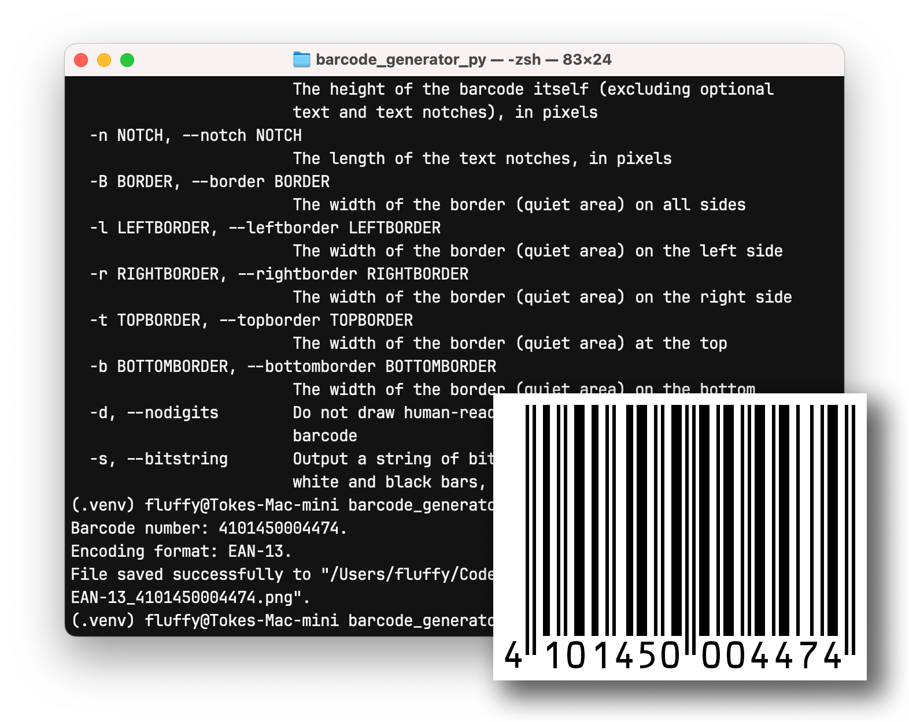

# BARCODE GENERATOR
#### Author: Toke Henrik Olesen
#### Video Demo: TODO

### General description:

Barcode generator is a command-line tool for quickly creating customizable barcodes. It supports the UPC-A, EAN-13 and
EAN-8 formats. The user can specify various options such as dimensions, border size, image format, bar width, whether
or not to include human-readable text, etc.

### Usage:

To generate a barcode, run the script with the barcode number as an argument. A PNG file will be created in the present
working directory. For example, typing "./barcode.py 697929110035" will create a file called
barcode_UPC-A_697929110035.png using the default settings.

Optionally, pass these arguments to customize the barcode:

- -o | --outputpath : specify the output path and file name. The file's extension will determine the image format.
- -w | --unitwidth : the width of an individual unit ("bar"), in pixels.
- -v | --verticalsize: the barcode's height, in pixels. This doesn't include the borders, if present.
- -n | --notch : the size of the text notches (the extensions of the side and middle guards). Use -n=0 if you don't want
a notch. By default, the notch reaches halfway down the text, even if the text is not visible.
- -B | --border : the size of the border, on all sides, in pixels. The border is white space surrounding the barcode.
- -l | --leftborder : the size of the border on the left, in pixels. Overrides the global setting set with -B.
- -r | --rightborder : the size of the border on the right, in pixels. Overrides the global setting set with -B.
- -t | --topborder : the size of the border on the top, in pixels. Overrides the global setting set with -B.
- -b | --bottomborder : the size of the border on the bottom, in pixels. Overrides the global setting set with -B.
- -d | --nodigits : disables drawing human-readable text underneath the barcode.
- -s | --string : outputs a string of 1s and 0s corresponding to the units ("bars") of the barcode.

For example: "./barcode.py 697929110035 -o my_barcode.bmp -w 8 -v 400 -n 0 -B 100 -b 10 -d" will create a file
called my_barcode.bmp, in the BMP format, with 8 pixel wide bars, 400 pixels tall, without text notches, with a border
100 pixels wide on all sides except the bottom, where it is 10 pixels wide, and with no human-readable text.

### Design overview:

The script takes advantage of the fact that all digits in a barcode are encoded using a combination of 7 bars, which are
either black or white; that makes it possible to represent each combination of bars as a 7-bit binary number.

The numbers corresponding to each value are stored as decimal values and converted to binary strings as needed. These
strings consist only of "0" and "1" characters.

Those strings are then joined together, along with the side and middle guards (patterns of bars indicating the beginning
or end of the barcode, as well as separating the barcode into two sides, which are encoded differently). This resulting
string can then be used directly to encode data in the PBM format, which is a simple image format for encoding 1-bit
graphics within a text file, where "0" in text encodes a white pixel, and "1" encodes a black pixel.

Finally, the complete PBM data string is loaded into memory as a file-like object, which is then used to construct a
Pillow Image object, which can be further modified, for example by adding human-readable text. Ultimately, before saving
to a file, it can be converted into any image format that Pillow supports.

### Function overview:

#### main:
Defines the command-line arguments (using the argparse module), checks and processes user input.

#### positive_int:
Defines a custom type for use with argparse: if the entered number is not a positive integer, raises an exception.

#### non_negative_int:
Defines a custom type for use with argparse: if the entered number is not a non-negative integer, raises an exception.

#### convert_to_pillow_image:
Takes PBM image data in the form of a string, creates a file-like object in memory, constructs a Pillow Image object
with that data and converts it to 8-bit grayscale (to enable font antialiasing when human-readable text gets added).
Returns the Pillow Image object.

#### save_pillow_image:
Exports the Pillow Image object to a file. The file's extension specifies the desired file format (for example,
"barcode.gif" will create a GIF file). If the format is not recognized or supported by Pillow, the program will close
with an error message.
Specifying an incorrect path and/or filename will also result in an error.

#### draw_digit_text:
Draws human-readable text underneath the barcode. This requires the "OCR-B.ttf" font file to be present in the same
directory as the script.

#### get_digit_groups:
Takes a barcode number as input and returns a tuple containing three elements: the leading digit (set to 0 if the
barcode format is not not EAN-13), the left side digits and the right side digits. This is necessary because digits
belonging to those three groups are all encoded differently (left side digits have odd parity, while right side digits
have even parity - with the exception of EAN-13 barcodes, where some left-side digits can also have even parity, though
with the bars in reverse order as compared to the right side bars. The exact combination of odd and even parity numbers
is how the leading digit in EAN-13 barcodes is encoded).

#### checksum_is_correct:
Returns True if the specified barcode number passes the checksum. If the optional keyword argument return_corrected is
True, returns the barcode number instead, with the check digit (the final digit) corrected. This can be useful when the
user wants to create a barcode encoding a custom number, but they don't want to work our the checksum themselves.
The checksum is calculated by getting a weighted sum of all the digits and subtracting it from 10 if it's not 0.

#### get_type:
Returns the barcode's type, as a string. If the number is not in a valid UPC-A, EAN-13 or EAN-8 format, raises an
exception.

#### get_bits:
A generator that yields a specified number of bits of a number, starting with the least significant bit. For example,
get_bits(6, 3) will yield 0, 1, and 1. It works by bit bitwise shifting the number to the right by 1 with each
iteration, and returning the result of a bitwise AND operation of the resulting number and 1.

#### encode_digit:
Encodes a single digit and returns a string of seven "0" or "1" characters. If the optional "parity" keyword argument
has been provided, uses the values stored in the left_encoding dictionary and uses the value of "parity" as the key.
Otherwise, uses the values stored in the right_encoding dictionary. The retrieved value is then passed as an argument to
the get_bits function.

#### encode_left_side:
Encodes the left side of the barcode. Depending on the format, the number of digits may be 7 (EAN-13), 6 (UPC-A) or 4
(EAN-8). In case of UPC-A and EAN-8, always uses values stored in the left_encoding dictionary using 0 as the key. This
is because in those formats left-hand side values always have odd parity.
In the case of EAN-13, the additional leading digit is encoded within the other 6 digits as a combination of their
parity; in contrast to UPC-A and EAN-8, some of those values may have even parity. The exact encoding pattern is stored
in the leading_digit_encoding dictionary. The relevant value is converted into a 6-bit binary number; each bit is then
used as the "parity" argument when the encode_digit function is called, thus returning the bit string with the correct
parity.

#### encode_right_side:
Like encode_left_side, but uses values stored in the right_side_encoding dictionary. Since those values always have even
parity, regardless of the format, no "parity" keyword argument needs to be provided.

#### encode_barcode:

Takes three arguments (leading digit, left side digits, and right side digits), converts them into strings of bits
and joins them together, along with bits encoding the side and middle guards. Returns the joined string, now
representing the complete barcode.

#### generate_notches:

Text notches are optional extentions of the side and middle guards, usually provided for visual effect, to help separate
the optional human-readable text into clearly definded groups of leading, left, and right digits. This function returns
a string that, when added to a PBM file, will encode those notches.

#### generate_pmb_data
Generates a string that encodes the barcode, as well as the border (but without the optional human-readable text) as
an image in the PBM format. PBM is a variant of the PPM format that encodes a 1-bit color image; that is, a pixel can
be either white or black. This means that we can use the bit string created using the encode_barcode function directly
to encode the visual representation of the barcode. If the desired unit width is higher than 1, the characters will be
repeated the required number of times. Borders and text notches, if desired, are also added at this stage.